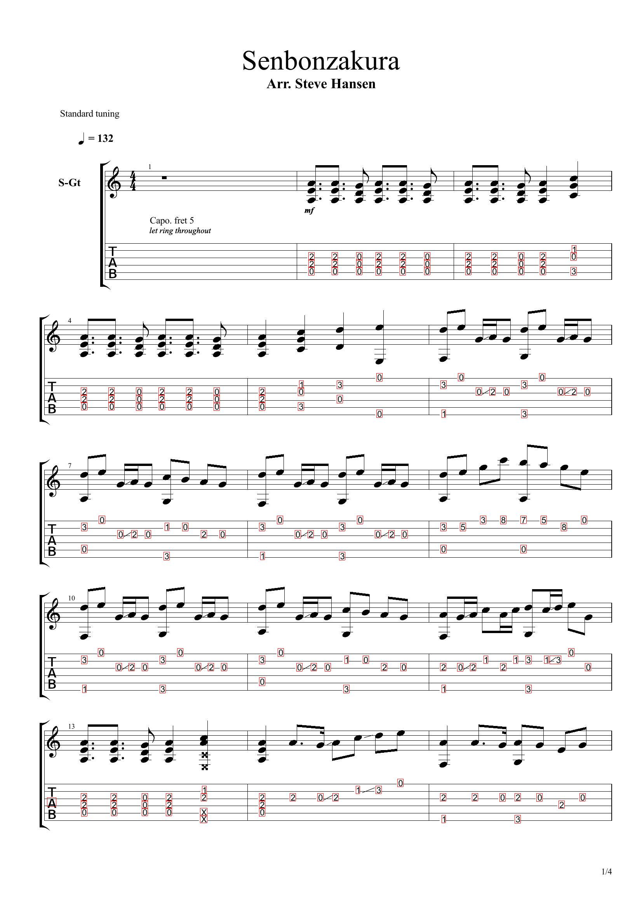
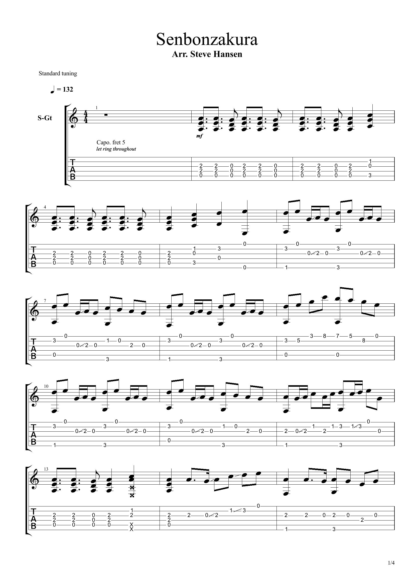

# Guitar-Tabs-Parser

Goal: Feed in a pdf or jpeg images of guitar tabs and be able to parse out each note and create a midi based on the tabs without the use of any external computer vision libraries.

## Progress

Image after running parser: 

Original image:

### These numbers are fed into the tesseract OCR with 100% accuracy.